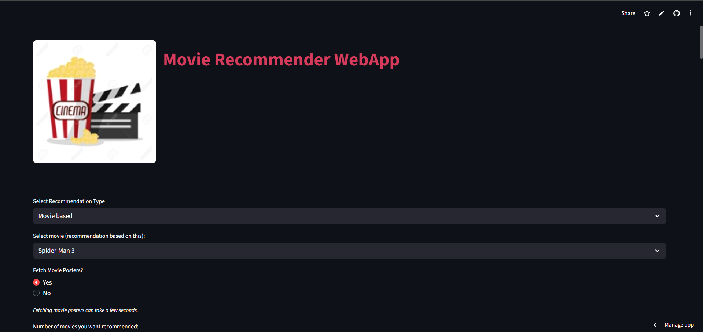
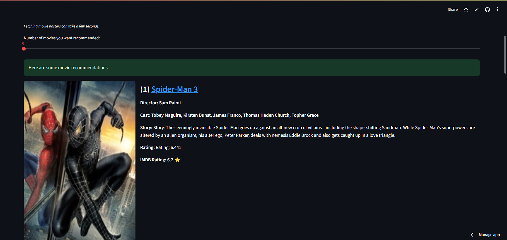

# 🍿 Movie Recommender WebApp

A Streamlit-based Movie Recommendation system that suggests movies based on either a selected movie or user-selected genres, leveraging a K-Nearest Neighbours algorithm and fetching rich movie metadata and posters from The Movie Database (TMDb) API.

---

## Features

- **Movie-based Recommendations:**  
  Select a movie and get a list of similar movies recommended by the KNN model.

- **Genre-based Recommendations:**  
  Select one or more genres and minimum IMDb rating to get recommendations fitting those preferences.

- **Poster Fetching:**  
  Option to fetch and display movie posters via TMDb API.

- **Detailed Movie Information:**  
  For each recommended movie, display director, main cast, storyline, TMDb rating, and IMDb rating (from dataset).

- **Interactive UI:**  
  Built with Streamlit for an easy-to-use and responsive interface.

---

## Demo

Click here to try the app: https://movie-recommender-app-frkdrjwskbqeyt4ptfrefg.streamlit.app/
---

## Screenshots






---

## Dataset

The app uses two main JSON files as datasets:

- **`movie_data.json`**:  
  Contains the feature vectors for movies, including genre indicators and IMDb ratings used for the KNN recommendation algorithm.

- **`movie_titles.json`**:  
  Contains movie metadata like titles and other descriptive attributes that help display results.

> These datasets are essential for the recommendation engine and should be present in the project directory.

---

## Tech Stack

- **Python** — Core programming language.
- **Streamlit** — For building the interactive web UI.
- **Pillow (PIL)** — Image processing and poster display.
- **Requests** — To handle API calls to TMDb.
- **KNearestNeighbours** — Custom KNN classifier implemented in `Classifier.py`.
- **TMDb API** — To fetch movie details and posters dynamically.

---


## Installation

1. **Clone the repository:**

   ```bash
   git clone https://github.com/SwarnangkurDey/Movie-recommender-app.git
   cd Movie-recommender-app


